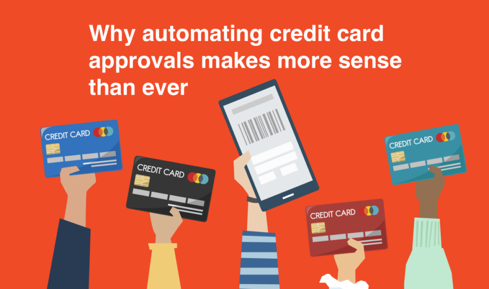

# Credit Card Approval System

## Overview
The Credit Card Approval System is a machine learning-based project designed to predict whether a credit card application should be approved or denied. The system leverages various applicant attributes to make predictions and aims to streamline the approval process while minimizing risk.

## Features
- **Data Preprocessing**: Handling missing values, encoding categorical variables, and feature scaling.
- **Model Training**: Utilizes algorithms like Logistic Regression, Decision Trees, or Random Forest to train the model.
- **Model Evaluation**: Performance metrics such as accuracy, precision, recall, and F1-score.
- **Deployment**: The model can be deployed using Flask or any other web framework.

## Installation
1. Clone the repository:
   ```bash
   git clone https://github.com/aryanc381/Credit-Card-Approval-System.git
   ```
2. Install the required packages:
   ```bash
   pip install scikit-learn numpy pandas matplotlib seaborn
   ```
3. Run the application:
   ```bash
   python app.py
   ```
4. Refer the DTC model for the backend
   ```bash
   card_model.pkl
   ```
5. If you want to make changes in the model, run JN
   ```bash
   python main.ipynb
   ```

## Dataset
The dataset used in this project is [Kaggle Dataset](https://www.kaggle.com/datasets/rohit265/credit-card-eligibility-data-determining-factors). It contains several features related to applicants' financial history, personal information, and credit history.

## Model Performance
- **Accuracy**: 0.96%
- **Precision**: 0.52%
- **Recall**: 0.99%
- **F1-Score**: 0.98%

## Contributions
Contributions are welcome! Please fork the repository and submit a pull request.

---

If you have any doubt regarding this repo, let me know in the email that I have mentioned in my profile section.
